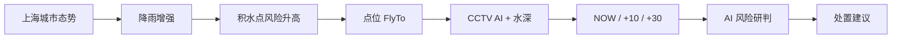
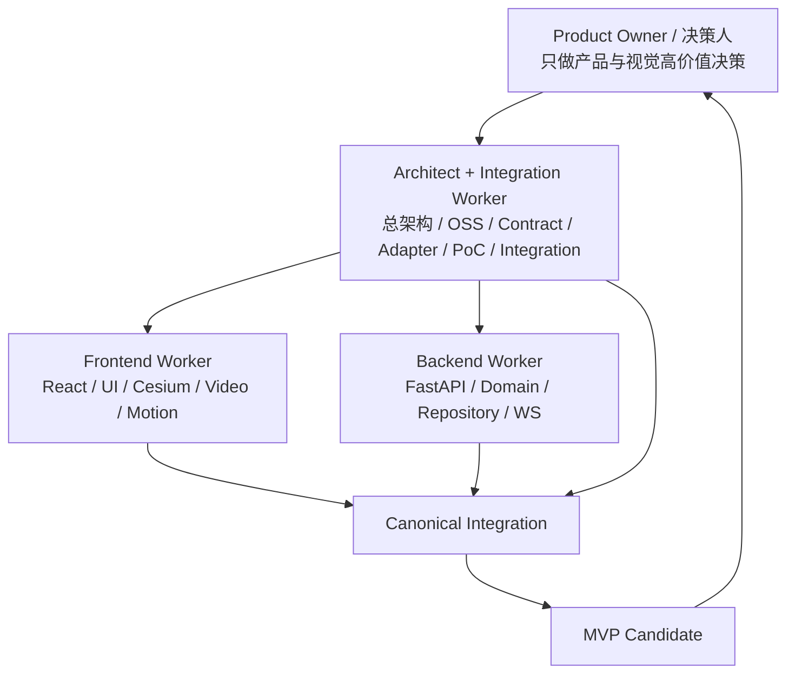
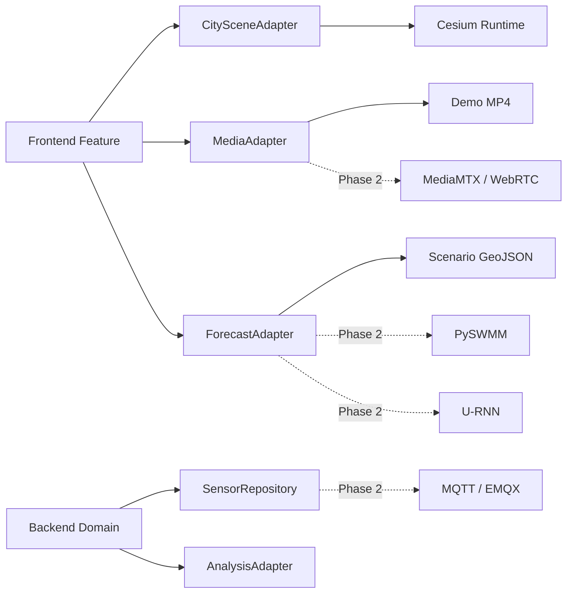
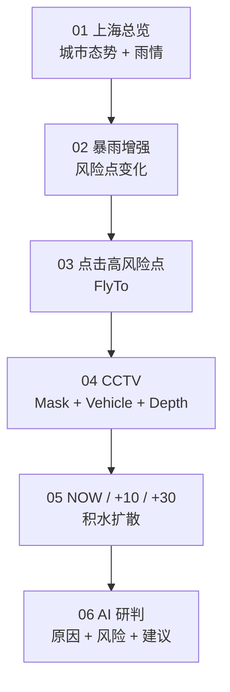

# 山水智鉴｜城市内涝智能防控中心
## MVP V0.1 Master Blueprint

> **状态**：FROZEN FOR MVP V0.1  
> **场景**：上海城市内涝数字孪生演示  
> **目标**：以 5 分钟演示为结果导向，在最短路径内交付“前端高完成度 + 核心链路可运行 + 技术接口可替换”的 MVP。  
> **执行模式**：Frontend Worker + Backend Worker + Architect/Integration Worker 三线并行。  
> **方法**：Lean-Guard + Golden Visual + Contract-Driven Parallel Development。

---

# 0. 一句话原则

```text
先冻结视觉、范围、契约
→ Architect 先跑 3 个薄 PoC
→ PoC 通过 Lean Gate
→ Frontend / Backend 并行
→ Architect 持续维护 Adapter / Contract / Integration
→ Mock 与真实实现保持同一接口
→ 只做 5 分钟主链所需功能
→ 1920×1080 浏览器演示通过
→ Delivery Manifest 收口
```

本轮**不是**建设完整智慧水务平台，而是建设一个可以清晰证明产品逻辑、技术路径和未来可扩展性的展示级 MVP。

---

# 1. 冻结结论

## 1.1 MVP 完成定义

本轮“完成”定义为：

1. 1920×1080 浏览器中稳定运行；
2. Golden Dashboard 视觉接近冻结稿；
3. 上海三维数字孪生城市可交互；
4. 水系、积水、风险点层次清楚；
5. CCTV Demo Video + AI Overlay 可运行；
6. NOW / +10 min / +30 min 积水预测可切换；
7. 事件卡、雨情、城市态势、时间轴可联动；
8. FastAPI 可提供与 Mock 相同 Contract 的数据；
9. AI 事件研判结果可展示；
10. 一条 5 分钟演示主链无断点。

本轮**不要求**：

- 真实上千个 IoT 设备接入；
- 真实 GB28181 / RTSP 监控体系；
- 完整上海排水管网；
- 实时 SWMM 城市级求解；
- 实时 U-RNN 推理；
- 完整用户权限 / 工单 / 系统管理；
- 完整多 Agent 平台；
- 全部导航页面完整实现。

---

# 2. 产品定位

> **山水智鉴｜城市内涝智能防控中心**

当前 MVP 的产品表达：

```text
城市级空间态势
+
多源感知
+
视频 AI
+
积水空间推演
+
风险研判
+
处置建议
```

核心不是“展示很多指标”，而是形成：



---

# 3. 三个 Worker



## 3.1 Frontend Worker

只负责：

- Golden Dashboard 视觉复刻；
- React 组件；
- Cesium 场景；
- 城市、水系、积水、风险点；
- CCTV / Overlay；
- Timeline / Forecast；
- Mock E2E；
- 页面交互；
- 浏览器端视觉性能。

禁止：

- 修改后端业务语义；
- 自行改变 Contract；
- 自行引入大型框架；
- 自行扩充业务模块；
- 自行替换 Golden Reference 的信息层级。

## 3.2 Backend Worker

只负责：

- FastAPI；
- Contract 对应 API；
- FixtureRepository；
- Event / Rainfall / Camera / Forecast 服务；
- WebSocket stub；
- Pydantic / schema 对齐；
- smoke / contract check。

禁止：

- 修改页面布局；
- 修改视觉 Token；
- 改 Contract 语义；
- 为“真实感”提前引入复杂数据库和中间件。

## 3.3 Architect + Integration Worker

负责：

- 维护本文件；
- 维护 `contracts/`；
- 维护 `03_ARCHITECTURE_OSS.md`；
- 开源选型；
- Cesium / Video / API 三个 PoC；
- Adapter 边界；
- 处理真正的产品/架构冲突；
- Integration；
- canonical worktree / commit；
- Delivery Manifest；
- 判断何时引入真实技术实现。

**Contract 只有 Architect Worker 有权修改。**

---

# 4. 冻结技术栈

## Frontend Runtime

```text
React 19
TypeScript
Vite
Tailwind CSS + CSS Variables
CesiumJS
ECharts
Zustand
Native <video> + Canvas Overlay
Framer Motion（仅 UI 状态转场，非必须处不使用）
```

说明：

- Cesium 使用原生 CesiumJS，React 只提供宿主和状态桥接；
- 本轮不强依赖 Resium；
- 不使用完整 UI 大组件库重塑视觉；
- 核心大屏组件按 Golden Reference 自定义实现。

## Backend Runtime

```text
Python 3.12+
FastAPI
Pydantic
Uvicorn
FixtureRepository
WebSocket
```

本轮默认不要求：

```text
Redis
Kafka
Kubernetes
微服务
TimescaleDB
复杂权限
```

PostgreSQL / PostGIS 作为 Phase 2 Repository，不阻塞 MVP。

---

# 5. 开源策略

开源只分三类：

```text
RUNTIME
真正进入本轮依赖

REFERENCE
研究架构和实现方式，不把整套系统引入项目

PHASE_2_ADAPTER
现在冻结接口，MVP 后再接
```

核心判断：

| 能力 | 项目 | 本轮角色 |
|---|---|---|
| 3D GIS | CesiumGS/cesium | RUNTIME |
| React-Cesium | reearth/resium | REFERENCE |
| 中国 Cesium 案例 | marsgis/mars3d | REFERENCE |
| React GIS 模板 | marsgis/mars3d-react-template | REFERENCE |
| 视频监控产品架构 | blakeblackshear/frigate | REFERENCE |
| 真视频流 | bluenviron/mediamtx | PHASE_2_ADAPTER |
| 水动力 | pyswmm/pyswmm | PHASE_2_ADAPTER |
| 城市内涝预测 | holmescao/U-RNN | PHASE_2_ADAPTER |
| 视频洪水定量 | xmlyqing00/V-FloodNet | RESEARCH_REFERENCE_ONLY |
| IoT | EMQX / ThingsBoard | PHASE_2_ADAPTER |

详细规则见 `03_ARCHITECTURE_OSS.md`。

---

# 6. 数字孪生核心架构

```mermaid
flowchart TB

    SCENE["DigitalTwinScene"]

    SCENE --> BASE["Base City Layer"]
    SCENE --> HYDRO["Hydro Layer"]
    SCENE --> OBS["Observation Layer"]
    SCENE --> RISK["Risk Layer"]
    SCENE --> CTRL["Scene Controller"]

    BASE --> TERRAIN["Terrain / Ground"]
    BASE --> BLD["3D Buildings"]
    BASE --> LM["Landmarks"]
    BASE --> ROAD["Road Context"]

    HYDRO --> RIVER["River Surface"]
    HYDRO --> FLOOD["Flood Surface"]
    HYDRO --> FORECAST["Forecast Surface"]
    HYDRO --> PIPE["Drainage Stub"]

    OBS --> RAIN["Rain Station"]
    OBS --> LEVEL["Water Level"]
    OBS --> CAMERA["Camera"]
    OBS --> DEVICE["Device"]

    RISK --> HOTSPOT["Flood Hotspot"]
    RISK --> AREA["Risk Area"]
    RISK --> SELECT["Selected Event"]

    CTRL --> FLY["FlyTo"]
    CTRL --> TIME["Timeline"]
    CTRL --> TOGGLE["Layer Toggle"]
    CTRL --> PICK["Pick / Select"]
```



**视觉原则：**

```text
建筑压下去
→ 河流水系拉出来
→ 道路积水再拉一层
→ 橙色只给当前风险事件
```

城市是空间背景，水系统是业务主角，当前事件是唯一强焦点。

---

# 7. Adapter 架构

不得让具体技术直接侵入页面或业务服务。



本轮必须保证：

```text
Demo 实现可替换
≠ 页面重写
```

---

# 8. Lean-Guard Gates

## Gate L0 — Freeze

必须存在：

- `references/golden-dashboard.png`
- `00_MASTER_BLUEPRINT.md`
- `01_PRODUCT_SPEC_MVP.md`
- `02_VISUAL_SCENE_SPEC.md`
- `03_ARCHITECTURE_OSS.md`
- `contracts/openapi.yaml`
- fixtures

通过后才允许大规模编码。

## Gate L1 — Cesium PoC

路径：

```text
spikes/cesium/
```

必须验证：

- 上海相机视角；
- 3D building；
- 1 个事件 Marker；
- 1 个 Flood Polygon；
- NOW / +10 / +30 三状态切换；
- FlyTo；
- Layer toggle。

PASS 才进入正式 `frontend/scenes/digital-twin/`。

## Gate L2 — Video PoC

路径：

```text
spikes/video/
```

必须验证：

- 本地 MP4；
- Canvas Overlay；
- bounding box；
- water mask；
- virtual gauge / depth；
- selected camera state。

本轮不要求 WebRTC。

## Gate L3 — API PoC

路径：

```text
spikes/api/
```

必须验证：

- FastAPI 启动；
- `/dashboard/overview`；
- `/flood-events/{id}`；
- `/forecast`；
- response 与 fixtures schema 一致。

## Gate L4 — Parallel Build

L1/L2/L3 通过以后：

```text
Frontend Worker
||
Backend Worker
||
Architect Adapter / Integration
```

并行推进。

## Gate L5 — Contract Integration

必须：

- Mock 和真实 API 同字段；
- 页面只切换 data source；
- 无页面级硬编码业务字段；
- error / empty / loading 状态存在。

## Gate L6 — Visual Demo

必须：

- 1920×1080；
- Golden Reference 主结构不漂移；
- 3D 城市不抢 UI；
- 水系 / 积水 / 风险层次清楚；
- 主场景目标 ≥ 30 FPS；
- FlyTo / Timeline / CCTV 无明显卡顿；
- 5 分钟主链一次走通。

## Gate L7 — Delivery

输出：

```text
06_DELIVERY_MANIFEST.md
```

只允许：

```text
PASS
CONDITIONAL
NOT VERIFIED
```

禁止把 build 通过写成“系统完成”。

---

# 9. 本轮必须实现的功能

## S — 必须

1. Golden Dashboard 首页；
2. 上海 3D 城市；
3. 城市态势；
4. 实时雨情；
5. 重点区域雨强排行；
6. Flood Hotspots；
7. 事件详情；
8. 水深 / 上涨速度 / 管网负荷；
9. NOW / +10 / +30；
10. CCTV Demo；
11. AI Overlay；
12. 时间轴；
13. Layer Controller；
14. 点位 FlyTo；
15. AI 事件研判；
16. FastAPI 与前端 Contract 联调。

## A — 有余力

- 管网示意图层；
- 相机列表；
- 风险区域切换；
- Event selection 状态；
- 事件原因占比可视化。

## B/C — 本轮不投入

- 完整风险预警页面；
- 内涝分析页面；
- 资源调度后台；
- 系统管理；
- 用户权限；
- 工单系统。

导航可以保留，非主页面只做壳或 `Coming Soon / MVP` 状态。

---

# 10. 5 分钟演示脚本对应开发顺序



所有开发优先级均以这条链是否变得更完整、更顺滑为唯一判断。

---

# 11. Mock / Synthetic Data 声明

本轮：

- 城市空间底座尽量真实；
- 业务事件和监测数值允许演示模拟；
- Demo Event、传感器数量、积水预测不宣称为上海实时官方数据；
- 数据结构必须符合未来真实系统替换要求。

前端可在页脚或 About 中保留：

```text
Demo Scenario Data
```

---

# 12. STOP Rules

Worker 遇到以下情况必须停止并交 Architect：

1. 想新增核心功能；
2. 想修改 Contract；
3. Golden Reference 与文档冲突；
4. 需要新的付费平台 / Secret；
5. 需要不可逆外部发布；
6. 需要引入大型框架；
7. 需要复制许可证不明确的代码；
8. PoC 未通过却准备继续堆正式代码；
9. 需要跨 Worker 修改 ownership 文件。

普通：

```text
padding
font-size
type error
build error
局部布局
可逆代码组织
```

自主处理，不升级给用户。

---

# 13. Definition of Done

MVP V0.1 只有满足以下条件才可称为候选交付：

- [ ] Visual Source of Truth frozen
- [ ] Contract frozen
- [ ] Cesium PoC PASS
- [ ] Video PoC PASS
- [ ] API PoC PASS
- [ ] Frontend runtime PASS
- [ ] Backend smoke PASS
- [ ] Contract check PASS
- [ ] 1920×1080 visual review MATCHED
- [ ] Main E2E PASS
- [ ] Demo script PASS
- [ ] Delivery Manifest completed

---

# 14. Worker 启动顺序

```text
Architect:
00 → 01 → 02 → 03 → contracts
        ↓
完成 L1/L2/L3 PoC
        ↓
Frontend / Backend Worker 启动
        ↓
持续集成
        ↓
Delivery Manifest
```

**不要让 Frontend Worker 自己研究整个 Cesium 生态；Architect 先把最小路径验证出来。**
