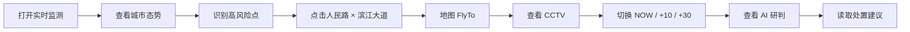

# 山水智鉴｜城市内涝智能防控中心
## PRODUCT_SPEC_MVP V0.1

> 本文只定义“本轮产品要做什么”。  
> 视觉以 `02_VISUAL_SCENE_SPEC.md + references/golden-dashboard.png` 为准。  
> 接口以 `contracts/` 为准。

---

# 1. 用户与使用场景

## 1.1 核心用户

MVP 默认用户：

- 城市运行 / 防汛值守人员；
- 水务 / 城管 / 应急业务人员；
- 比赛评委 / 产品演示观看者。

## 1.2 MVP 主要任务

用户打开系统后，应在 10 秒内回答：

1. 当前城市内涝风险是否严重？
2. 哪里正在出现高风险积水？
3. 当前雨势是否继续增强？
4. 某个点积水多深、上涨多快？
5. 未来 10 / 30 分钟会如何变化？
6. 现场视频是否支持这个判断？
7. AI 给出什么原因判断和处置建议？

---

# 2. 产品主链



---

# 3. 首页结构

导航保留：

```text
实时监测
风险预警
内涝分析
预测预报
资源调度
系统管理
```

本轮只有：

```text
实时监测
```

是完整主页面。

其他页面：

- 保留入口；
- 可以显示 MVP 壳；
- 不进入 S 级开发。

---

# 4. 首页必须出现的信息

## 4.1 城市态势

显示：

```text
严重 03
警戒 12
正常 137
```

要求：

- 一眼看懂；
- 使用环形 / 视觉化分布；
- 不用一堆泛 KPI 替代风险结构。

## 4.2 实时雨情

显示：

```text
当前雨强 23.6 mm/h
累计雨量 68.2 mm
持续时长 2 h 15 min
雨强趋势
```

用户可以看到最近约 120 分钟趋势。

## 4.3 重点区域雨强排行

至少 5 个区域/站点。

用途：

- 解释城市不同区域降雨不均；
- 为点击事件和空间风险提供上下文。

## 4.4 三维城市主场景

首页最重要区域。

必须：

- 上海城市空间关系；
- 黄浦江 / 核心水系；
- 多个观测点；
- 3 个等级风险点；
- 当前 selected event；
- 水深色带；
- Layer toolbar；
- FlyTo。

## 4.5 当前事件

固定 Demo 事件：

```text
Event ID: FP202506010024
人民路 × 滨江大道
所属区域：黄浦区
事件类型：道路积水

当前水深：28.6 cm
上涨速度：1.8 cm/min
管网负荷：91%
风险等级：高
```

这些是演示场景数据，不宣称为上海真实实时官方数据。

## 4.6 内涝预测

至少三个时间状态：

```text
NOW
+10 min
+30 min
```

右侧可以有三个缩略图，但核心必须驱动中央 3D 场景变化。

## 4.7 CCTV

显示：

- Demo 视频；
- LIVE 状态；
- water mask；
- vehicle / person boxes；
- 水深；
- camera name。

本轮视频可来自本地 MP4。

## 4.8 时间轴

底部：

```text
00:00 — 24:00
当前时间 10:24
实时 / 回放状态
```

MVP 主流程中至少支持：

- 播放按钮视觉状态；
- NOW / forecast 状态联动；
- 时间定位。

---

# 5. 关键交互

| ID | 交互 | 必须 |
|---|---|---|
| I01 | 点击风险点 | 是 |
| I02 | FlyTo 点位 | 是 |
| I03 | selected marker 高亮 | 是 |
| I04 | Layer 开关 | 是 |
| I05 | 水深图层开关 | 是 |
| I06 | 视频卡播放 | 是 |
| I07 | NOW/+10/+30 切换 | 是 |
| I08 | 预测切换驱动中心地图 | 是 |
| I09 | 底部时间轴状态切换 | 是 |
| I10 | AI 研判展开/读取 | 是 |
| I11 | 完整管网钻取 | 否 |
| I12 | 工单派发 | 否 |

---

# 6. AI 研判

本轮 AI 不做聊天主界面。

输入语义：

```text
current_depth
rise_rate
rainfall
pipe_load
forecast_depth
selected_event
```

输出：

```text
risk_summary
causes[]
forecast_summary
actions[]
```

Demo 结果示例：

```text
风险判断：
当前积水持续快速上升，未来 30 分钟可能进入严重积水状态。

主要原因：
1. 短时强降雨；
2. 下游排水管网负荷高；
3. 局部低洼地形汇水。

建议：
1. 调度移动泵车；
2. 对高风险车道实施交通管控；
3. 对周边地下空间发送预警。
```

本轮可以由 Fixture / LLM API 产生，UI 不依赖实现来源。

---

# 7. 数据来源策略

```text
城市空间：
真实或公开空间底座

业务监测值：
Scenario Fixture

CCTV：
Demo MP4

AI Overlay：
预处理或演示 JSON

Forecast：
预计算 GeoJSON / Scenario JSON

AI Analysis：
Fixture 或 LLM API
```

原则：

> UI 永远读统一 Contract，不知道后面是真设备还是 Demo Fixture。

---

# 8. 页面状态

所有 S 级组件至少支持：

```text
loading
ready
empty
error
selected（如适用）
```

演示默认进入 `ready`。

---

# 9. Non-goals

本轮明确不做：

- 登录 / 注册；
- 完整角色权限；
- 真实设备管理；
- 完整录像管理；
- PTZ；
- 工单；
- 真实泵站控制；
- 全城管网实时运算；
- 完整预警规则配置；
- 复杂告警中心；
- 多租户；
- 完整 CaseMemory UI；
- 完整水务资产台账。

---

# 10. 5 分钟 Demo Acceptance

演示时必须能完成：

```text
打开首页
→ 看到上海与城市风险
→ 看到雨情增强
→ 点击高风险点
→ 镜头飞入
→ 查看 CCTV
→ 查看水深和上涨速度
→ 切换 +10 / +30
→ 看到空间范围扩大
→ AI 给出原因与建议
```

全链不需要进入第二个完整业务页面。
