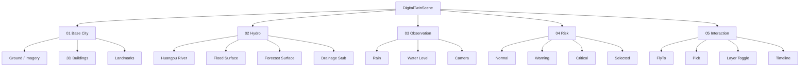

# 山水智鉴｜城市内涝智能防控中心
## VISUAL_SCENE_SPEC V0.1

> **Golden Reference**：`references/golden-dashboard.png`  
> 优先级：Golden Reference > 本文 > Component Implementation > Page-local Style。

---

# 1. 视觉方向冻结

关键词：

```text
暗色
白天
阴天
低饱和
数字孪生
蓝灰城市
青蓝水系
橙色风险
专业
克制
高信息密度但层级明确
```

禁止误解为：

```text
夜景
赛博朋克
霓虹城市
电竞大屏
纯黑背景
高饱和蓝光
大量装饰角标
```

Golden Reference 的核心不是“黑”，而是：

> **阴天白日的低亮度城市 + 深蓝灰半透明 UI。**

---

# 2. 画布与布局

基准：

```text
1920 × 1080
16:9
Desktop Only for MVP
```

推荐分区：

```text
Top Header: 68–76 px
Bottom Timeline: 64–76 px

Left Column: 430–480 px
Right Column: 430–470 px
Center Scene: 剩余全部空间
```

原则：

- 中间不是一张“地图卡片”；
- 整个工作区背景就是 3D Scene；
- 左右面板覆盖在 Scene 上；
- UI 总占用不超过约 35–40% 视觉面积；
- 中心场景保持绝对主角。

---

# 3. Color Tokens

推荐初始 Token：

```css
--bg-app: #071421;
--bg-panel: rgba(6, 24, 39, 0.88);
--bg-panel-soft: rgba(9, 31, 49, 0.78);

--border-subtle: rgba(83, 180, 229, 0.22);
--border-active: rgba(71, 193, 255, 0.68);

--text-primary: #EAF6FF;
--text-secondary: #91AFC3;
--text-muted: #627F93;

--cyan: #27D7E8;
--blue: #2B8DFF;
--teal: #28C2C4;

--warning: #FF9A37;
--critical: #FF5B4D;
--normal: #2AD7C7;

--river: #17495E;
--flood-low: #32D4EA;
--flood-mid: #208DFF;
--flood-high: #686FE8;
--flood-critical: #FF9A37;
```

这些是初始设计 Token，最终以截图对照微调。

---

# 4. Panel Style

Panel 统一：

```text
背景：深蓝灰半透明
边界：1px 低透明青蓝
圆角：6–10px
阴影：轻，禁止厚重
发光：只给 selected / critical
```

禁止：

- 机甲切角；
- 大量渐变边框；
- 每个卡片都 Glow；
- 全页面橙红；
- 复杂玻璃折射。

---

# 5. Typography

层级：

```text
Logo / Product Name       28–34
Page Section Title        18–22
Metric Number             24–38
Metric Unit               12–16
Body / Table              13–15
Metadata                  11–13
```

数字优先一眼读取：

```text
28.6 cm
1.8 cm/min
91%
```

不要写成大段：

```text
当前积水水位为 28.6 厘米
```

---

# 6. Component Inventory

## Layout

- `AppHeader`
- `TopNav`
- `DashboardShell`
- `LeftPanelStack`
- `RightPanelStack`
- `BottomTimeline`

## Business UI

- `UrbanStatusPanel`
- `RainfallPanel`
- `RainfallRankingPanel`
- `FloodEventPanel`
- `ForecastPreviewPanel`
- `DepthLegend`
- `LayerToolbar`
- `VideoMonitorCard`
- `AIAnalysisPanel`

## 3D

- `DigitalTwinScene`
- `CityBaseLayer`
- `RiverLayer`
- `FloodSurfaceLayer`
- `ForecastSurfaceLayer`
- `ObservationMarkerLayer`
- `RiskMarkerLayer`
- `SelectedEventPopup`
- `SceneController`

---

# 7. 3D Digital Twin Scene — 核心规则



---

# 8. 上海城市怎么表达

## 8.1 城市空间

目标：

```text
真实上海空间识别
+
数字孪生统一材质
```

MVP 推荐：

```text
Cesium OSM Buildings
+
公开地形 / imagery
+
2–3 个必要 Landmark（可选）
```

不追求照片级真实纹理。

## 8.2 建筑视觉

普通建筑：

```text
低饱和蓝灰
降低对比
不发光
不做窗户夜景
```

重点建筑：

```text
略提升亮度 / 轮廓
不改变整体基调
```

风险建筑：

**不直接整栋染红。**

风险应由：

```text
Flood Surface
+
Risk Halo
+
Marker
+
Popup
```

表达。

## 8.3 白天而非夜景

Scene 必须：

- cloudy / overcast；
- 有环境光；
- 建筑能读出体积；
- 远景有 haze；
- 不出现大面积亮窗；
- 不出现夜间灯带作为主视觉。

可使用：

- imagery brightness；
- saturation；
- contrast；
- fog；
- atmosphere；
- globe lighting；

统一压暗而不是“关灯”。

---

# 9. 水系表达 — 三层严格分开

## 9.1 River / 真实水系

黄浦江 / 苏州河属于空间背景。

视觉：

```text
深青蓝
低饱和
低亮度
轻微流动
```

它的作用是：

- 建立上海空间识别；
- 引导视觉；
- 不与“道路积水”竞争。

## 9.2 Flood / 道路积水

业务主角。

表达：

```text
GeoJSON Polygon
+
Depth Attribute
+
半透明 Surface
+
轻微动态材质
+
边缘高亮
```

水深色带：

| Depth | Color role |
|---|---|
| 0–10 cm | 淡青 |
| 10–20 cm | 青蓝 |
| 20–30 cm | 蓝 |
| 30–50 cm | 蓝紫 |
| >50 cm | 橙红 |

**橙红仅用于高风险。**

## 9.3 Forecast / 未来积水

和 Flood 使用同一渲染系统。

只变：

```text
geometry
depth
timeKey
```

支持：

```text
NOW
+10min
+30min
```

切换 Forecast 时：

- 右侧缩略图 active 状态改变；
- 中央主场景积水范围更新；
- event forecast number 更新；
- timeline state 更新。

---

# 10. 风险点

三类：

```text
NORMAL
WARNING
CRITICAL
```

颜色：

```text
Normal: cyan / teal
Warning: orange
Critical: red-orange
```

规则：

- 全局最多 1 个 selected event；
- selected event 才允许强 Halo；
- 普通点位不要全部动态闪烁；
- 远距离只显示图标；
- 近距离显示 label / popup。

---

# 11. Popup

冻结 Demo：

```text
人民路 × 滨江大道
28.6 cm
```

Popup：

- 橙棕色半透明；
- 与 Marker 锚定；
- 不遮挡中央关键建筑；
- FlyTo 后保持可见。

---

# 12. Layer Toolbar

至少：

```text
图层
水深
管网
视频
测距（可仅视觉）
```

MVP 真正可用：

- 图层；
- 水深；
- 视频；
- 管网可为 stub。

selected 状态使用 cyan，而不是大面积填充。

---

# 13. 城市态势 Panel

信息冻结：

```text
严重 03
警戒 12
正常 137
```

必须比传统 KPI 更直观。

结构：

```text
Donut / Ring
+
3 个状态行
```

不要重新改回六个泛化 KPI 卡。

---

# 14. 实时雨情 Panel

指标：

```text
当前雨强 23.6 mm/h
累计雨量 68.2 mm
持续时长 2 h 15 min
```

下方：

```text
最近 120 min 雨强趋势
```

折线面积图：

- cyan 主线；
- 关键峰值少量 warning；
- grid 很淡；
- 不使用多色 chart。

---

# 15. 重点区域雨强排行

只做 5 行。

布局：

```text
排名
站点名
水平条
数值
```

第一名可 warning/critical，后面蓝青。

不要把这一块做成复杂表格。

---

# 16. Event Panel

必须维持 Golden Reference 的 2×2 主指标：

```text
当前水深 28.6 cm
上涨速度 1.8 cm/min
管网负荷 91%
风险等级 高
```

橙色只用于数值焦点。

---

# 17. Forecast Preview

3 张：

```text
NOW
+10 min
+30 min
```

规则：

- 小图只是辅助；
- active 有 cyan border；
- 中心 3D Scene 才是主推演空间；
- 不能只让三个缩略图变化而中央地图不变。

---

# 18. CCTV / Video Monitor

结构：

```text
Camera Header
LIVE
Video
AI Overlay
Legend
Depth
```

MVP：

```text
<video>
+
absolute <canvas>
```

Overlay 包括：

- flood mask；
- vehicle box；
- person box；
- water depth gauge。

不得让视频框占据过大面积；它是 Evidence，不是首页主角。

---

# 19. Motion

允许：

- Cesium FlyTo；
- selected marker pulse；
- forecast surface cross-fade；
- timeline thumb；
- UI panel 150–250ms transition；
- flood surface very subtle motion。

禁止：

- panel 持续呼吸；
- 所有图标闪烁；
- 大量粒子；
- 大面积扫描线；
- 炫技型 loading。

---

# 20. 视觉验收

固定 viewport：

```text
1920×1080
```

每次核心 Review 对照：

```text
reference
implementation
```

检查：

1. Layout proportion；
2. City brightness；
3. Water hierarchy；
4. Panel density；
5. Risk color usage；
6. Typography；
7. Selected focus；
8. CCTV scale；
9. Bottom timeline；
10. Center map readability。

本轮允许实现细节和 Reference 有微差，但禁止：

- 变亮成白色后台；
- 变黑成夜景；
- 中央地图缩成普通卡片；
- 城市概览替代城市态势；
- 积水与河流同一种视觉；
- 把 Orange 用成主题色。
