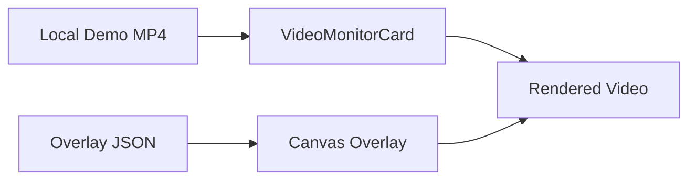
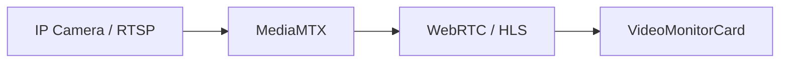
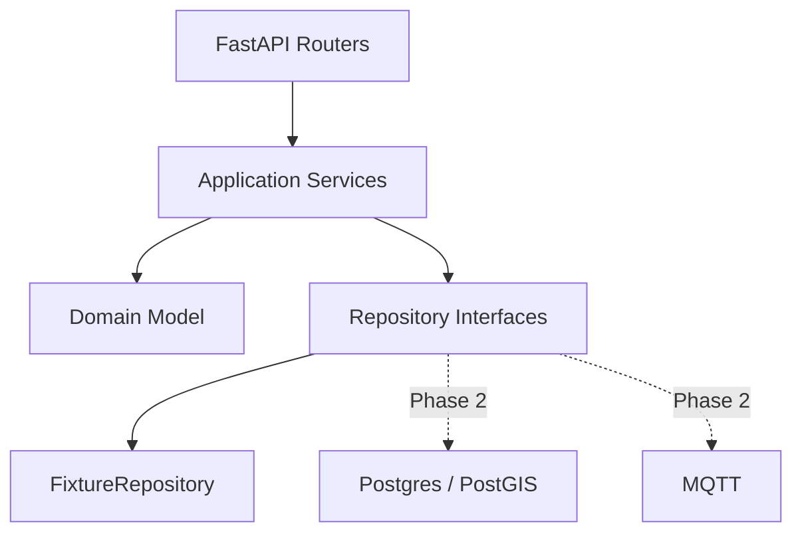

# 山水智鉴｜城市内涝智能防控中心
## ARCHITECTURE_OSS V0.1

> 目标：最大化复用成熟开源思路，同时避免“为了复用而引入整个平台”。

---

# 1. 核心策略

所有开源项目进入三种状态之一：

```text
RUNTIME
REFERENCE
PHASE_2_ADAPTER
```

另有：

```text
RESEARCH_REFERENCE_ONLY
```

用于许可证不清或不适合直接复用的项目。

---

# 2. OSS Matrix

| Project | URL | License / Status | Role | MVP Decision |
|---|---|---|---|---|
| CesiumJS | https://github.com/CesiumGS/cesium | Apache-2.0 | 3D GIS runtime | USE |
| Resium | https://github.com/reearth/resium | MIT | React/Cesium reference | REFERENCE |
| Mars3D | https://github.com/marsgis/mars3d | Apache-2.0 | Cesium 3D GIS case library | REFERENCE |
| Mars3D React Template | https://github.com/marsgis/mars3d-react-template | Apache-2.0 | React GIS organization reference | REFERENCE |
| Frigate | https://github.com/blakeblackshear/frigate | MIT | video monitor architecture | REFERENCE |
| MediaMTX | https://github.com/bluenviron/mediamtx | MIT | RTSP→WebRTC/HLS | PHASE 2 |
| PySWMM | https://github.com/pyswmm/pyswmm | BSD-2 | SWMM adapter | PHASE 2 |
| U-RNN | https://github.com/holmescao/U-RNN | MIT | flood forecast model | PHASE 2 |
| V-FloodNet | https://github.com/xmlyqing00/V-FloodNet | license not declared in repo metadata | research | RESEARCH ONLY |
| EMQX | https://github.com/emqx/emqx | open source | MQTT broker | PHASE 2 |
| ThingsBoard | https://github.com/thingsboard/thingsboard | open source | IoT platform | PHASE 2 |

---

# 3. 为什么 Runtime 只放 Cesium

本轮要最大化可控性。

3D 场景需要：

- 自定义 camera；
- 自定义 imagery / brightness / saturation；
- OSM buildings；
- GeoJSON flood；
- feature styling；
- custom material；
- marker；
- picking；
- timeline；
- layer toggle。

因此：

```text
React
  ↓
DigitalTwinScene
  ↓
CesiumJS
```

而不是：

```text
React
  ↓
大型 GIS Framework
  ↓
多层抽象
  ↓
Cesium
```

Resium 可以参考，但不作为强制 runtime。

---

# 4. Cesium 复用路径

直接研究 Cesium 官方：

```text
createOsmBuildingsAsync
3D Tiles feature styling
Water material
Terrain
GeoJSON
Entity / Primitive
Camera flyTo
Picking
```

MVP 只需要组合这些成熟能力，不自己写 WebGL 引擎。

## 4.1 推荐工程边界

```text
frontend/scenes/digital-twin/
├── DigitalTwinScene.tsx
├── scene-controller.ts
├── layers/
│   ├── city-base-layer.ts
│   ├── river-layer.ts
│   ├── flood-layer.ts
│   ├── forecast-layer.ts
│   ├── observation-layer.ts
│   └── risk-layer.ts
└── adapters/
    └── cesium-scene-adapter.ts
```

React 负责：

- props；
- selected state；
- UI。

Cesium 模块负责：

- viewer；
- entity；
- primitive；
- camera；
- scene lifecycle。

---

# 5. Mars3D 的使用方式

Mars3D：

```text
不作为最终 runtime
```

它的价值：

- 大量中国 3D GIS 场景案例；
- Cesium 视觉效果路径；
- 常见 Layer / Graphic 组织思路；
- React 项目模板可参考目录组织。

Architect Worker 可以研究案例并把最小实现迁移为原生 Cesium，不要把整个平台嫁接进 MVP。

---

# 6. 视频架构

## 6.1 MVP



推荐：

```text
Native video
+
Canvas
```

本轮不需要 HLS.js / WebRTC。

## 6.2 Frigate 参考什么

参考 Frigate 的：

- Live Player 组件边界；
- camera selection；
- live / offline / loading state；
- video wall 的布局逻辑；
- overlay 与 player 解耦；
- WebRTC / MSE fallback 思路。

不引入 Frigate backend。

## 6.3 Phase 2



此时只替换 `MediaAdapter`。

---

# 7. Flood Forecast 架构

## MVP

```text
ScenarioForecastAdapter
```

输入：

```text
eventId
timeKey
```

输出：

```text
GeoJSON FeatureCollection
depth legend
maxDepth
affectedArea
```

MVP 数据：

```text
NOW
+10
+30
```

均可提前生成。

## Phase 2 — PySWMM

```text
PySWMM
→ node/link simulation
→ result converter
→ Forecast contract
```

页面无感。

## Phase 2 — U-RNN

```text
U-RNN
→ raster / grid prediction
→ vector/raster adapter
→ Forecast contract
```

页面无感。

---

# 8. Vision 架构

MVP 不要求实时 inference。

```text
Demo Video
+
Overlay JSON
```

Overlay schema：

```json
{
  "timestampMs": 2400,
  "waterDepthCm": 32.8,
  "objects": [],
  "waterMask": []
}
```

Phase 2 可换：

```text
YOLO / segmentation service
```

V-FloodNet 可用于理解：

- urban flood segmentation；
- flood quantification；
- reference object logic。

**因为仓库许可证信息不明确，本轮不复制其源代码。**

---

# 9. Backend 架构



MVP 最重要的是接口边界，不是数据库。

---

# 10. Domain Objects

MVP 对外主要暴露：

```text
DashboardOverview
RainfallSnapshot
FloodPoint
FloodEvent
FloodForecast
Camera
AIAnalysis
TimelineState
```

内部可保留山水智鉴领域链：

```text
Observation
→ EvidenceBundle
→ EventCandidate
→ GovernanceEvent
```

但不要让前端被这些内部概念绑死。

---

# 11. Scene Data 与 Business Data 分离

```text
Scene Data:
geometry / lat / lon / polygon / layer style

Business Data:
depth / risk / rainfall / event / camera / analysis
```

例如：

```text
Flood Event
  ├── business event JSON
  └── forecast geometry GeoJSON
```

禁止把所有数据写进 Cesium Entity properties 以后由 UI 反向解析。

---

# 12. 未来替换原则

所有 Adapter 都必须做到：

```text
Scenario implementation
        ↓ replace
Real implementation

Contract unchanged
```

包括：

```text
DemoVideoMediaAdapter → MediaMTXAdapter
ScenarioForecastAdapter → PySWMMAdapter / URNNAdapter
FixtureSensorRepository → MQTTRepository
FixtureAnalysisAdapter → LLMAnalysisAdapter
```

---

# 13. 开源复制规则

允许：

- 使用明确许可的依赖；
- 参考架构；
- 参考目录；
- 按许可证要求复用少量代码；
- 保留 NOTICE / LICENSE 要求。

禁止：

- 复制许可证未声明项目的源码；
- 把完整 Frigate / ThingsBoard 当业务前端；
- 为一个小功能引入整个大型系统；
- 把开源项目的数据模型直接当山水智鉴 Domain Model。

---

# 14. 当前技术风险

| Risk | Lean Mitigation |
|---|---|
| Cesium 上海 3D 数据质量 | PoC first；支持 fallback |
| Cesium ion token | env 配置；交付 Manifest 明确 |
| 中国坐标偏移 | Demo 几何统一 WGS84，不混用 GCJ-02 |
| OSM building 高度不完整 | 视觉上接受；必要时补少量 landmark |
| 洪水面显得假 | 独立 Flood Layer + depth palette + subtle material |
| Video 看起来像假监控 | Overlay 与视频独立、时间同步 |
| Forecast 没真实模型 | 明确 Scenario Adapter，后期可替换 |
| 开源架构过重 | Reference ≠ Runtime |
| 网络演示不稳定 | 视频 / forecast / overlay 全部本地；3D 底座后期可缓存/录制 |
