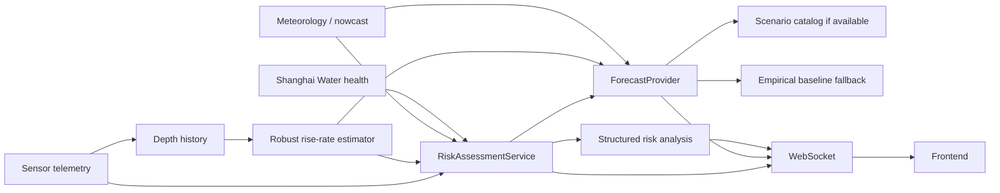
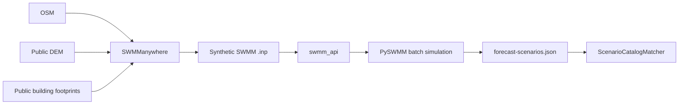

# Realtime Intelligence + Open-Source Hydrodynamic Roadmap

## Runtime path now implemented



The risk index is not a probability. Hard safety rules can raise the minimum risk level. Missing/stale Sensor evidence reduces confidence instead of forcing the risk to NORMAL.

## Forecast provider ladder

```text
SCENARIO_LIBRARY
    ↓ catalog unavailable / poor match
EMPIRICAL_BASELINE
    ↓ no live sensor
SYNTHETIC_FIXTURE
```

The empirical baseline exposes uncertainty and method metadata. It is not described as a calibrated hydrodynamic model.

## Offline open-source physical-model path



Heavy SWMM tooling remains under `research/swmm` and is not imported by the FastAPI runtime.

## Truth boundary

- SWMManywhere network: `SYNTHETIC_UDM`, not official Shanghai drainage GIS.
- `pipeLoadPercent`: scenario baseline until real pipe-network telemetry/model output replaces it.
- Empirical +10/+30: transparent MVP baseline.
- Scenario-library +10/+30: precomputed physical-model support, quality depends on the synthetic/official model and calibration.
- LLM may explain structured results; it does not calculate risk level, depth, road closure or dispatch.
