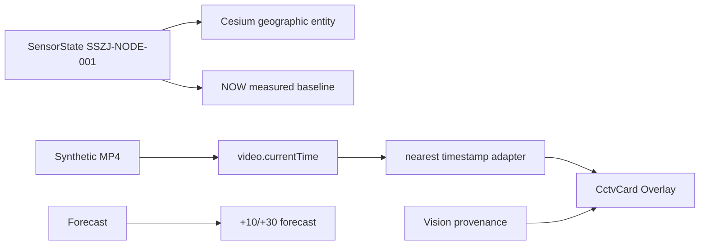

# RC2.1 Closure — Main Independent Progress

更新时间：2026-08-24  
代码 checkpoint：`27d2917`；public Main closure docs：已随当前 main 更新
immutable release tag：`rc2-evidence-demo` → `b0a41d1e2245e60ed55eef2777ea03d6b899d6c2`  
状态：`CONDITIONAL / VISUAL_REVIEW`

## 本轮目标

在不扩展算法、不引入真实未授权素材、不混淆 SENSOR / VISION / FORECAST 的前提下，收口 RC2 的跨模块连接：

## 已完成并独立验收

| 闭环 | Main 结果 | 证据 |
|---|---|---|
| Backend provenance | PASS | `cc545c6`; upload=`not_required`，remote URL=`pending`；`backend/smoke.py` PASS |
| Cesium SensorState | PASS / CONDITIONAL | `47e575c` + `eb122f0`; `sensor-state`、`SSZJ-NODE-001`、28.6cm、WGS84、fallback=false |
| Dashboard video adapter | PASS | `1ca94bd` + `9a29528`; flat frame normalize、nearest timestamp、null-depth guard |
| Browser video asset | PASS / CONDITIONAL | `e990129`; 2,419-byte H.264 baseline、3 frames、Chrome decode PASS |
| Vision image mask resource seam | PASS / CONDITIONAL | `27d2917`; upload returns browser-readable mask API URL, backend artifact route returns PNG 200, drawer defaults to `水体识别`; UI hides confidence while API evidence remains intact |
| Frontend build | PASS | `npm run typecheck`、`npm run build`；仅 Cesium 大 chunk warning |
| Backend / Vision / Media | PASS / CONDITIONAL | backend smoke、vision smoke、media synthetic check、adapter smoke 全通过 |
| Docs / minimal CI | ADDED | `75856d4`；CI remote execution remains `NOT VERIFIED` |

## 主线浏览器验收

本地服务：`http://127.0.0.1:4173/`

- MP4：`readyState=4`、320×240、duration=1、error=null。
- 首帧显示 `RESULT FRAME · flood_cam_017-F000000`；播放到约 0.72s 后切换为 `F000002`。
- 页面同时显示 `SYNTHETIC_DEMO`、`estimatedDepthCm=null`、`CAMERA_UNCALIBRATED`。
- Cesium mount：`data-sensor-mode=sensor-state`、`data-sensor-id=SSZJ-NODE-001`、`data-sensor-depth-cm=28.6`、entity count=1、forecast ready。
- 浏览器 console errors：0；主页面没有横向/纵向 overflow（默认 viewport smoke）。
- Vision image API：`flood_no_reference.jpg` → `floodDetected=true`、`waterMaskPath` 可读取 PNG 200、`rangeCm` 显示为 `≥50 cm`；无参考物时 `estimatedDepthCm=null` 仍保持不变。

## 仍未完成 / 不作为本轮阻塞

1. 真实 CCTV/LIVE 接入、真实来源授权、HLS/WebRTC：`NOT VERIFIED`。
2. CameraProfile/几何标定和真实厘米值：`NOT VERIFIED`；视频 overlay 所有 `estimatedDepthCm` 仍为 `null`。
3. 视频 mask 当前是 metadata-only，未逐像素绘制到视频；`rendered=false` 是有意边界。
4. V-FloodNet 等模型升级、GT、IoU/F1/MAE：`MODEL_UPGRADE=NOT_VERIFIED`。
5. PostGIS 真机迁移/重启持久化、硬件 ESP32/STM32、MQTT/4G/Wi-Fi：`NOT VERIFIED`。
6. `.github/workflows/ci.yml` 已加入，但远端 Actions 执行和 branch protection 尚未验证。
7. 用户最终视觉验收仍保持 `VISUAL_REVIEW`。

## 不再派发的内容

- 不新增视觉面板、SensorHealthPanel、第二套视频 pipeline 或新 worker。
- 不把 synthetic browser asset 标为 CCTV/LIVE 或实测水深。
- 不在 RC2.1 继续训练/下载模型；下一阶段另立 RC3。
